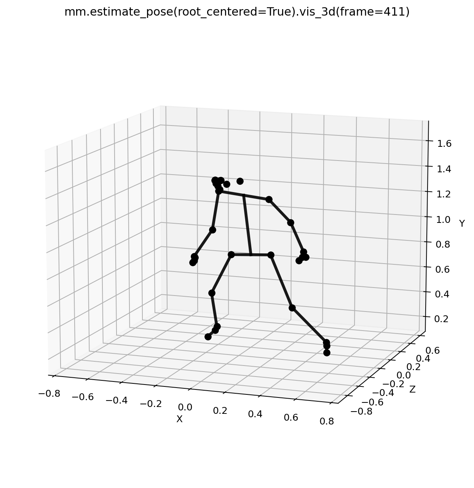
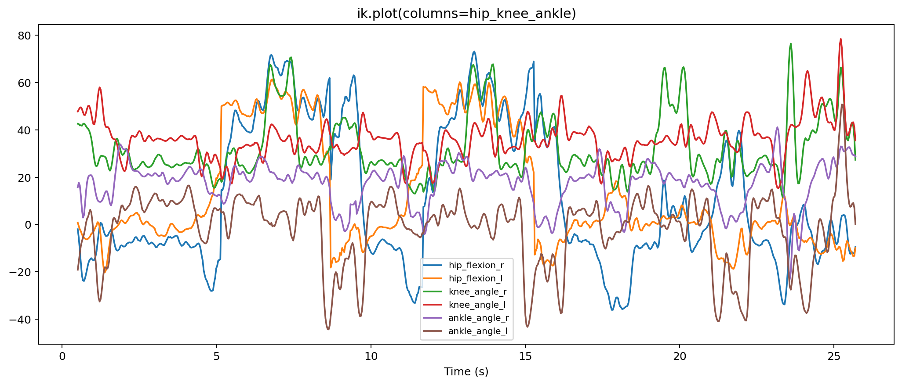
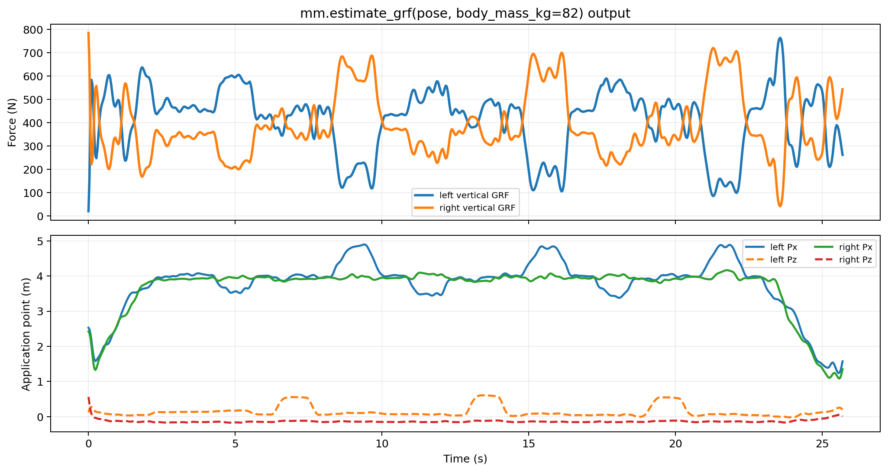
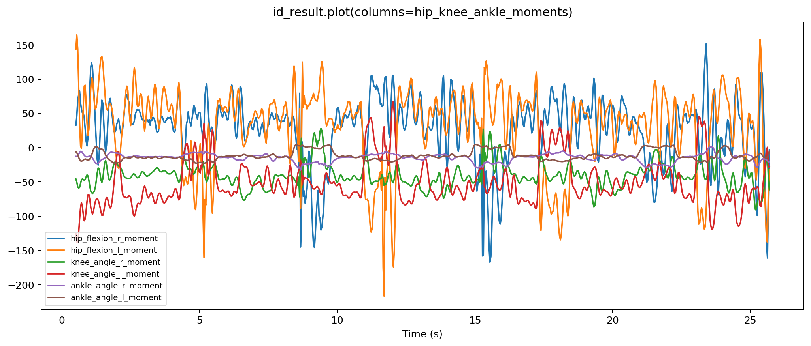
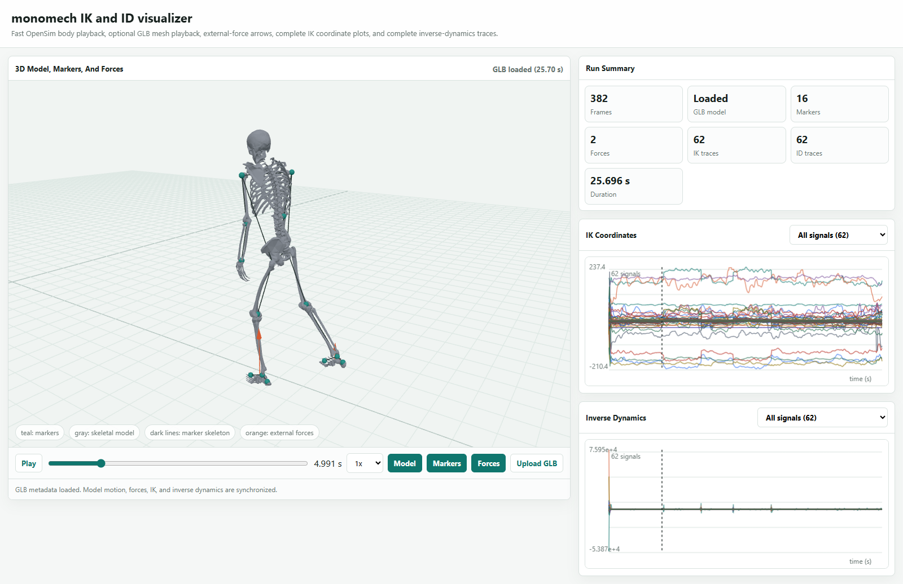

# Examples

The examples are designed to be read top to bottom. Each notebook keeps input paths near the top, writes into a dedicated output folder, and pauses after important stages so you can inspect the data before continuing.

## Notebook Guide

| Notebook | Start here when | Main outputs |
| --- | --- | --- |
| [`video_to_trc_quickstart.ipynb`](https://github.com/chags1313/monomech/blob/main/examples/video_to_trc_quickstart.ipynb) | You have a single-camera video and want CSV/TRC exports. | pose CSV files, global TRC |
| [`marker_trc_cleanup.ipynb`](https://github.com/chags1313/monomech/blob/main/examples/marker_trc_cleanup.ipynb) | You already have a TRC file and want a cleaned version. | marker summary, cleaned TRC |
| [`opensim_scale_ik_template.ipynb`](https://github.com/chags1313/monomech/blob/main/examples/opensim_scale_ik_template.ipynb) | You have a TRC and want OpenSim scale and IK. | scale setup, scaled model, IK motion |
| [`video_to_inverse_dynamics_pipeline.ipynb`](https://github.com/chags1313/monomech/blob/main/examples/video_to_inverse_dynamics_pipeline.ipynb) | You want video to TRC, scale, IK, external loads, and ID. | pose outputs, OpenSim files, estimated loads, ID storage |
| [`run_video_smoke.py`](https://github.com/chags1313/monomech/blob/main/examples/run_video_smoke.py) | You want a repeatable command-line check for a real video. | JSON report, CSV, TRC, optional OpenSim outputs |

## Suggested Order

<div class="mono-path" markdown>
<div class="mono-step" markdown>
**Verify import**

Run the first cell before pointing at large data files.
</div>
<div class="mono-step" markdown>
**Set paths once**

Edit the input path and output directory variables near the top.
</div>
<div class="mono-step" markdown>
**Inspect before export**

Use summaries and DataFrame previews before writing files.
</div>
<div class="mono-step" markdown>
**Move downstream slowly**

Only run OpenSim after marker names, units, and time ranges look sensible.
</div>
</div>

## What A Complete Example Shows

The full video-to-ID notebook is organized around the same checkpoints used by the docs tour. You should be able to see the 2D pose on the source image, the root-centered 3D pose, the global pose after PnP and floor alignment, key IK angles, estimated force signals, key ID kinetics, and the synchronized animation viewer.













## Full Video To ID Example

```python
import monomech as mm

pose = mm.estimate_pose("data/subject01.mp4")
pose = mm.gap_fill(mm.smooth(pose))

scale = mm.run_scaling(
    pose,
    model="pose",
    output_dir="outputs/subject01/scale",
)

ik = mm.run_ik(scale, output_dir="outputs/subject01/ik")

estimated_loads = mm.estimate_grf(pose, body_mass_kg=75.0)

id_result = mm.run_id(
    ik=ik,
    external_forces=estimated_loads,
    output_dir="outputs/subject01/id",
)

print(id_result.path)
print(id_result.metadata["external_loads_mot_path"])
```

## Command-Line Smoke Test

```bash
python examples/run_video_smoke.py "data/subject01.mp4" --output-dir outputs/subject01_smoke
```

Run OpenSim too when the bindings are installed:

```bash
python examples/run_video_smoke.py "data/subject01.mp4" --output-dir outputs/subject01_smoke --opensim
```

## Minimal Video Example

```python
from pathlib import Path
import monomech as mm

video_path = Path("data/subject01.mp4")
output_dir = Path("outputs/subject01")
output_dir.mkdir(parents=True, exist_ok=True)

pose3d_global = mm.estimate_pose(video_path)
pose3d_global = mm.gap_fill(mm.smooth(pose3d_global))

pose3d_global.to_csv(output_dir / "subject01_global.csv")
pose3d_global.to_trc(output_dir / "subject01_global.trc")
```

## Minimal Marker Example

```python
from pathlib import Path
import monomech as mm

trc_path = Path("data/walk.trc")
output_dir = Path("outputs/walk")
output_dir.mkdir(parents=True, exist_ok=True)

markers = mm.gap_fill(trc_path, max_gap_frames=20)
markers = mm.smooth(markers, cutoff_hz=6.0)

display(markers.summary())
markers.to_trc(output_dir / "walk_clean.trc")
```

## Good Notebook Hygiene

- Keep raw input files in `data/` and generated files in `outputs/`.
- Save intermediate CSV files while tuning pose, smoothing, or marker mapping.
- Record the exact install command and package version in the first notebook cell.
- Use one notebook per subject when parameter choices differ between trials.
- Keep OpenSim scale, IK, external-load, and ID sections separate so failures are easier to debug.
