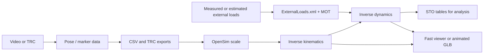

<section class="mono-hero" markdown>

# monomech

Single-camera biomechanics that stays inspectable from the first video frame to OpenSim inverse dynamics.

<div class="mono-badges" markdown>
<span class="mono-badge">Python 3.10-3.12</span>
<span class="mono-badge">Video to TRC</span>
<span class="mono-badge">External loads</span>
<span class="mono-badge">OpenSim IK and ID</span>
<span class="mono-badge">Fast viewer and GLB animation</span>
</div>

</section>

`monomech` is built for researchers, students, and developers who want a clear path from raw motion data to reproducible biomechanical files. It keeps each stage separate enough to inspect, but connected enough to run a full pipeline once the inputs look right.

## Start With Your Input

<div class="grid cards" markdown>

-   :material-video-outline: **I have a video**

    Estimate 2D pose, lift to world/global 3D, export CSV/TRC, then continue into OpenSim when the marker data checks out.

    [:octicons-arrow-right-24: Video workflow](getting-started.md#video-first-workflow)

-   :material-table: **I have a TRC**

    Load marker data, summarize missing values, fill gaps, smooth trajectories, and export a cleaned TRC.

    [:octicons-arrow-right-24: Marker workflow](getting-started.md#marker-first-workflow)

-   :material-weight-lifter: **I need external loads**

    Build OpenSim loads from force plates, arrays, constant loads, carried objects, or estimated ground reaction forces.

    [:octicons-arrow-right-24: Forces guide](stages/forces.md)

-   :material-run-fast: **I need IK and ID**

    Scale a model, run inverse kinematics, inspect marker errors, add external loads, and run inverse dynamics.

    [:octicons-arrow-right-24: OpenSim guide](stages/opensim.md)

-   :material-cube-scan: **I need a viewer**

    Review IK, ID, forces, and body motion quickly, then export a GLB when you need full meshes.

    [:octicons-arrow-right-24: Animation export](stages/animation.md)

</div>

## End-To-End Map



## Install

=== "Base import and TRC tools"

    ```bash
    python -m pip install monomech
    ```

=== "Video pose"

    ```bash
    python -m pip install "monomech[pose]"
    ```

=== "OpenSim"

    ```bash
    python -m pip install "monomech[opensim]"
    ```

=== "Animation"

    ```bash
    python -m pip install "monomech[animation]"
    ```

=== "Everything"

    ```bash
    python -m pip install "monomech[all]"
    ```

!!! tip "Start light"
    The base install is intentionally lightweight. Optional video and OpenSim packages are imported only when their workflows need them.

## First Video Export

```python
from pathlib import Path
import monomech as mm

video_path = Path("data/subject01.mp4")
output_dir = Path("outputs/subject01")
output_dir.mkdir(parents=True, exist_ok=True)

pose = mm.estimate_pose(video_path, root_centered=False, floored=True)
pose = mm.gap_fill(mm.smooth(pose))

pose.vis_2d(frame=50)
pose.vis_3d(frame=50)

pose.to_csv(output_dir / "subject01_pose.csv")
trc_path = pose.to_trc(output_dir / "subject01.trc")
print(trc_path)
```

## First OpenSim Run

```python
scale = mm.run_scaling(
    pose,
    model="pose",
    output_dir=output_dir / "scale",
)

ik = mm.run_ik(scale, output_dir=output_dir / "ik")

estimated_loads = mm.estimate_grf(pose, body_mass_kg=75.0)

id_result = mm.run_id(
    ik=ik,
    external_forces=estimated_loads,
    output_dir=output_dir / "id",
)

viewer = mm.animate(
    ik=ik,
    id=id_result,
    external_loads_path=id_result.metadata["external_loads_mot_path"],
    output_dir=output_dir / "visualizer",
    render="fast",
)
viewer.show()
```

## Built-In Preflight Checks

OpenSim tools can fail on NaNs, infinite values, mismatched timing, or missing files. `monomech` preflights the common problems before running the tools:

| Stage | Default behavior | Where to inspect |
| --- | --- | --- |
| Scale | Interpolates TRC marker gaps when needed. | `scale.metadata["preflight"]` |
| IK | Interpolates TRC marker gaps and stores marker error summaries. | `ik.metadata["preflight"]` |
| ID | Interpolates IK coordinate NaNs before inverse dynamics. | `id_result.metadata["coordinate_preflight"]` |
| External loads | Resamples loads to IK time and fills non-finite force values. | `id_result.metadata["external_loads_mot_path"]` |

## Recommended Next Steps

<div class="grid cards" markdown>

-   **New users**

    Follow [Getting started](getting-started.md) from environment setup through exports and troubleshooting.

-   **Examples**

    Open [Example notebooks](examples.md) for video, marker cleanup, OpenSim setup, and video-to-ID.

-   **API reference**

    Use [API reference](api.md) for function signatures, result methods, and config objects.

-   **External loads**

    Read [External loads and forces](stages/forces.md) before trusting inverse dynamics results.

-   **Outputs**

    Use [Outputs and files](outputs.md) to understand CSV, TRC, MOT, STO, XML, and model artifacts.

-   **Visualization**

    Use the fast no-GLB visualizer for notebook review, or export a single GLB from IK and ID outputs with [OpenSim animation export](stages/animation.md).

</div>
