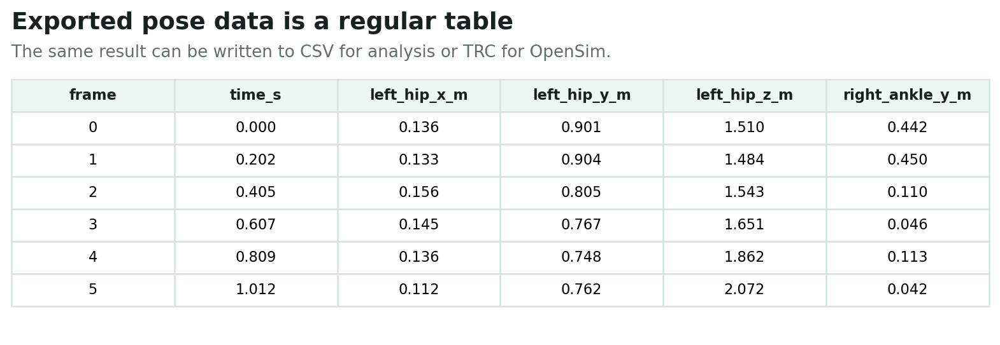

# Outputs and Files

`monomech` result objects are designed to be inspectable in notebooks and useful in downstream tools.



## Common Result Methods

Most pose and marker results provide:

- `to_wide_df()` for wide-form analysis tables
- `to_long_df()` for long-form analysis tables
- `to_csv(path)` for CSV export
- `to_trc(path, model_path=...)` where marker/TRC export is supported
- `summary()` for quick quality checks
- `vis_2d(frame=...)` and `vis_3d(frame=...)` for pose or marker previews
- `.smooth(...)` and `.gap_fill(...)` on compatible results

## Video Pipeline Outputs

```python
pose = mm.estimate_pose("subject01.mp4")
pose = mm.gap_fill(mm.smooth(pose))

pose.to_csv("outputs/subject01/subject01_pose.csv")
pose.to_trc("outputs/subject01/subject01.trc", model_path=mm.get_builtin_osim_model("pose"))
```

Typical files:

```text
outputs/subject01/
  subject01_pose2d.csv
  subject01_pose3d_world.csv
  subject01_pose3d_global.csv
  subject01.trc
```

## Marker Pipeline Outputs

```python
markers = mm.gap_fill("walk.trc", max_gap_frames=20)
markers = mm.smooth(markers, cutoff_hz=6.0)
markers.to_trc("outputs/walk_clean.trc")
```

Typical files:

```text
outputs/
  walk_clean.trc
```

## OpenSim Outputs

Scale, IK, and ID methods write OpenSim setup files and result files into stage-specific directories by default:

```text
outputs/
  subject01/
    scale/
      *_scale_setup.xml
      *_scaled.osim
    ik/
      *_ik_setup.xml
      *_ik.mot
      _ik_marker_errors.sto
    id/
      *_id_setup.xml
      *_id.sto
      *_ExternalLoads.xml
```

Exact names depend on the source trial and OpenSim stage configuration.

The OpenSim tables are ordinary time series. IK produces coordinate trajectories, external-load files contain force and point signals, and ID produces force and moment traces.


## Recommended Layout

Use one output directory per subject or trial:

```text
outputs/
  subject01_walk/
    pose/
    scale/
    ik/
    id/
  subject02_walk/
    pose/
    scale/
    ik/
    id/
```

This keeps intermediate pose data, exported TRC files, and OpenSim results together without mixing subjects.
