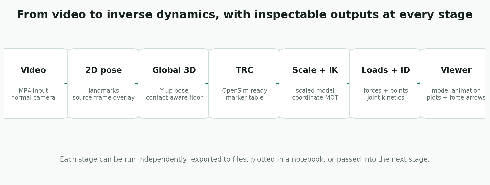

# Full Pipeline

The pipeline helpers run the common workflows in one call while still returning every stage output. Use the one-line functions for repeatable processing, and use the staged calls when you are tuning model fit, marker cleanup, external loads, or OpenSim settings.



## Notebook Workflow

Use the short names when you want each processing step to be visible and inspectable:

```python
import monomech as mm

pose = mm.estimate_pose(
    "data/subject01.mp4",
    root_centered=False,
    floored=True,
)

pose = mm.smooth(pose, cutoff_hz=6.0)
pose = mm.gap_fill(pose, max_gap_frames=12)

pose.vis_2d(frame=80)
pose.vis_3d(frame=80)

scaled_model = mm.run_scaling(
    pose,
    model="pose",
    output_dir="outputs/subject01/scale",
)

ik = mm.run_ik(
    scaled_model,
    output_dir="outputs/subject01/ik",
)

ik.plot()
ik.to_csv("outputs/subject01/ik.csv")
```


Add loads, run ID, and display the notebook visualizer:

```python
dumbbell = mm.load(type="carried", body="hand_r", mass_kg=10.0)
grf = mm.estimate_grf(pose, body_mass_kg=82.0)
forces = mm.external_forces(loads=[dumbbell, *grf])

id_result = mm.run_id(
    ik=ik,
    external_forces=forces,
    output_dir="outputs/subject01/id",
)

animation = mm.animate(
    ik=ik,
    id=id_result,
    external_loads_path=id_result.metadata["external_loads_mot_path"],
    output_dir="outputs/subject01/visualizer",
)

animation.show()
```


## Video To TRC

```python
import monomech as mm

run = mm.video_to_trc(
    "data/subject01.mp4",
    output_dir="outputs/subject01",
    sample_fps=30,
)

print(run.trc_path)
```

## Returned Object

The returned `PipelineRun` can contain:

| Attribute | Meaning |
| --- | --- |
| `pose2d` | 2D landmark result. |
| `pose3d_world` | MediaPipe world landmark result. |
| `pose3d_global` | Global 3D pose result suitable for export. |
| `csv_paths` | CSV files written during export. |
| `trc_path` | OpenSim-ready TRC path. |

## TRC Markers To Inverse Dynamics

Use `trc_to_inverse_dynamics()` when you already have an OpenSim-ready TRC:

```python
import monomech as mm

result = mm.trc_to_inverse_dynamics(
    "outputs/subject01/subject01.trc",
    model_path="models/subject01_scaled.osim",
    output_dir="outputs/subject01/opensim",
    external_forces=None,
)

print(result.ik.path)
print(result.id.path)
```

Pass measured or estimated external loads when you need kinetics:

```python
loads = mm.external.from_csv(
    "data/right_force_plate.csv",
    applied_to_body="calcn_r",
    force_columns=("Fx", "Fy", "Fz"),
    point_columns=("Px", "Py", "Pz"),
    time_column="time",
    name="right_grf",
)

result = mm.trc_to_inverse_dynamics(
    "outputs/subject01/subject01.trc",
    model_path="models/subject01_scaled.osim",
    output_dir="outputs/subject01/opensim",
    external_forces=loads,
)
```

## Video To Inverse Dynamics

Use `video_to_inverse_dynamics()` for the complete path from video to pose, TRC, IK, ID, optional GLB, and an HTML visualizer:

```python
import monomech as mm

result = mm.video_to_inverse_dynamics(
    "data/subject01.mp4",
    model_path="models/subject01_scaled.osim",
    output_dir="outputs/subject01",
    body_mass_kg=75.0,
)

print(result.trc_path)
print(result.ik.path)
print(result.id.path)
print(result.visualizer.html_path)
result.display()
```

By default, `video_to_inverse_dynamics()` uses estimated bilateral ground-reaction forces from the pose result. Use measured force-plate data for quantitative kinetics, or pass `external_forces=None` to run ID without external loads as a setup check.

To combine estimated ground-reaction forces with a carried object, include `"estimate"` alongside the extra load:

```python
dumbbell = mm.external.carried_load(
    mass_kg=12.5,
    applied_to_body="radius_r",
    point=(0.0, -0.2, 0.0),
    name="right_dumbbell",
)

result = mm.video_to_inverse_dynamics(
    "data/curl.mp4",
    model_path=mm.get_builtin_osim_model("pose"),
    output_dir="outputs/curl",
    body_mass_kg=82.0,
    external_forces=mm.external.with_estimated_grf(dumbbell),
)

result.display()
```

## What To Inspect At Each Stop

| Step | Check |
| --- | --- |
| Pose result | Landmark coverage, obvious tracking failures, frame rate, and time vector. |
| TRC export | Marker names, units, axes, and missing values. |
| Scale | Scaled model path, setup XML, log, and `scale.metadata["preflight"]`. |
| IK | `ik.metadata["marker_error_summary"]` and coordinate plots. |
| External loads | Generated MOT/XML, force signs, center-of-pressure units, and time alignment. |
| ID | STO columns, sign conventions, and whether moments are plausible for the task. |
| Animation | GLB size, dropped nodes, missing geometry, and whether the motion looks plausible. |

## When To Use It

Use `video_to_trc()` for repeatable video-to-TRC processing once you know the settings you want.

Use `trc_to_inverse_dynamics()` when your input is already a TRC. Use `video_to_inverse_dynamics()` when you want the complete video-to-ID path in one line. Use individual stage methods when you are exploring data, debugging model fit, tuning smoothing/export settings, or adding external loads for inverse dynamics.
