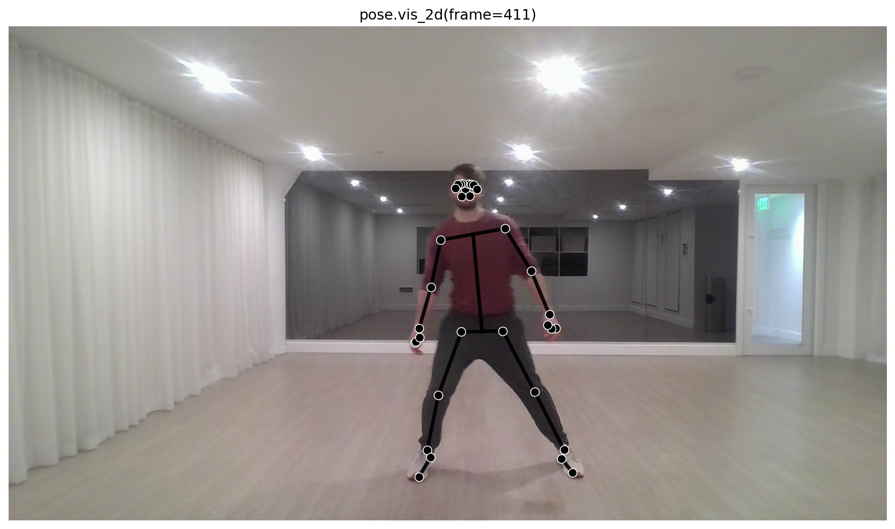
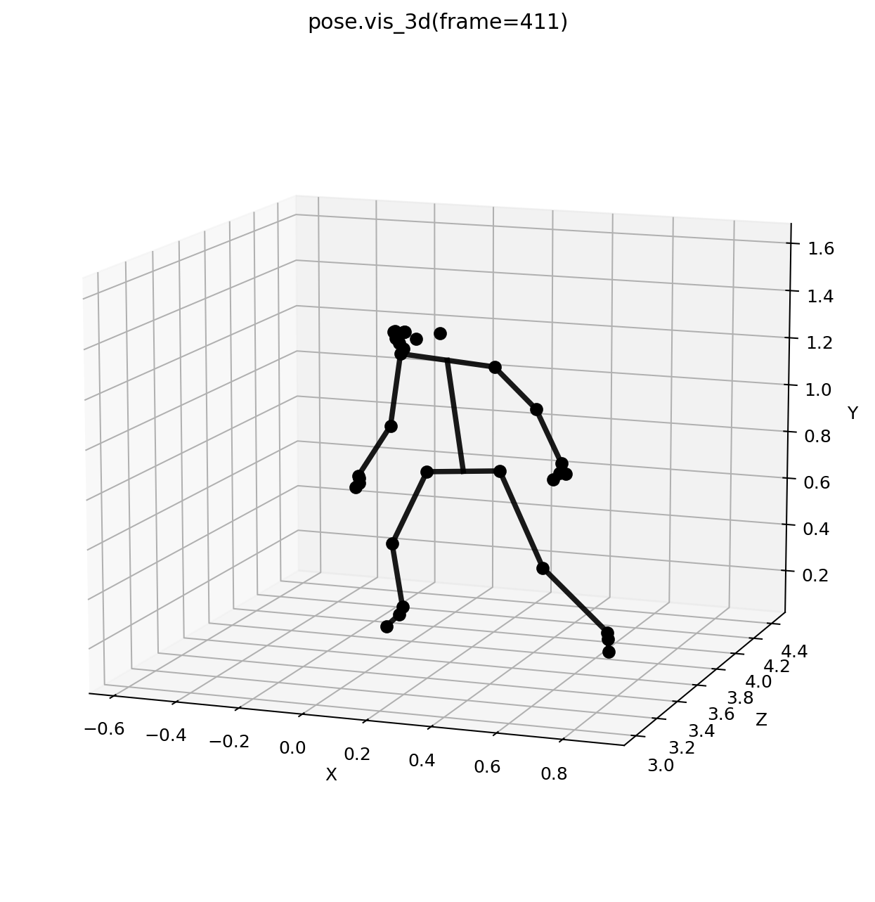
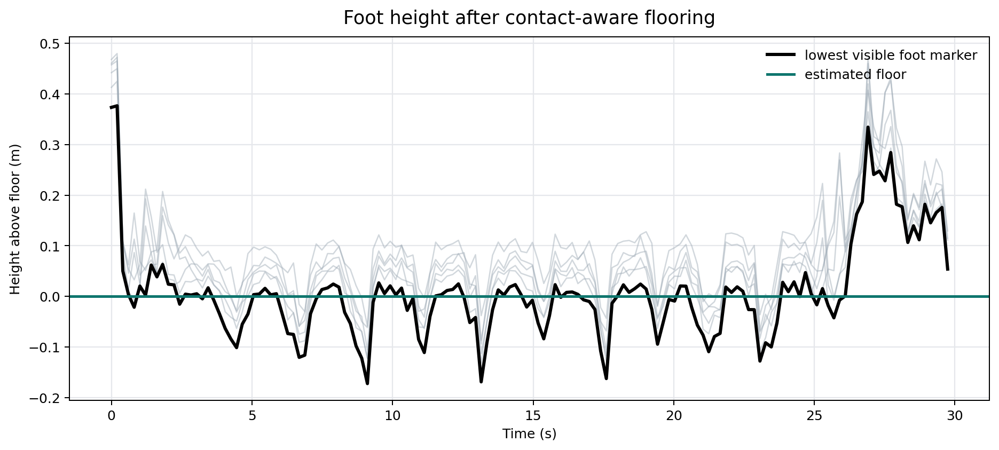

# Global Pose

The global pose stage converts video landmarks into a Y-up, floor-aligned coordinate system for previews, CSV export, TRC export, scaling, IK, and inverse dynamics.

```python
pose3d_global = mm.estimate_pose(
    "subject01.mp4",
    root_centered=False,
    floored=True,
)
```



## Built-In Floor Estimation

`floored=True` is the default because most biomechanics workflows need the support surface to be stable before exporting a TRC. The default `floor_method="auto"` now uses foot-contact evidence rather than a simple foot-height median:

1. It estimates whether the incoming vertical axis points up or down.
2. It identifies visible foot markers.
3. It prefers low-velocity foot samples, which are more likely to be stance contacts.
4. It estimates a static floor from the support-foot envelope.
5. It records the decision in result metadata so you can inspect the quality.

```python
pose = mm.estimate_pose("subject01.mp4", root_centered=False, floored=True)

print(pose.metadata["floor_method"])
print(pose.metadata["floor_contact_frames"])
print(pose.metadata["floor_contact_samples"])
print(pose.metadata["floor_y"])
```



## Floor Methods

| Method | Behavior |
| --- | --- |
| `auto` | Uses the contact-aware estimator and falls back when the video does not have enough usable stance samples. |
| `foot_contact` | Same estimator as `auto`, useful when you want explicit configuration. |
| `feet_median` | Uses the median visible foot height. This is simple and stable for clean standing trials. |
| `min_y` | Uses the lowest visible body/foot envelope after resolving vertical direction. |
| `none` | Keeps the data Y-up without applying a floor shift. This is what `floored=False` uses. |

Use `Pose3DGlobalConfig` when you want reproducible floor settings:

```python
config = mm.Pose3DGlobalConfig(
    translation_method="pnp",
    floor_method="foot_contact",
    floor_percentile=90.0,
    floor_contact_velocity_percentile=35.0,
    floor_contact_height_percentile=35.0,
    floor_min_contact_samples=6,
    smooth_root=True,
)

pose = mm.estimate_pose("subject01.mp4", global_config=config)
```

The estimator is intentionally conservative. It does not assume every low-looking foot point is ground contact; it first asks whether that marker is moving like a stance foot.



## Export

```python
pose3d_global.to_csv("outputs/subject01_global.csv")
pose3d_global.to_trc("outputs/subject01_global.trc", model_path="model.osim")
```

## Configuration

```python
config = mm.Pose3DGlobalConfig(translation_method="pnp", floor_method="auto")

pose3d_global = mm.estimate_pose("subject01.mp4", global_config=config)
```

## Common Uses

- Inspect whole-body motion in a common coordinate frame.
- Create TRC files for OpenSim workflows.
- Compare trials using consistent landmark names and timing.
- Check floor-contact quality before estimating ground reaction forces.
