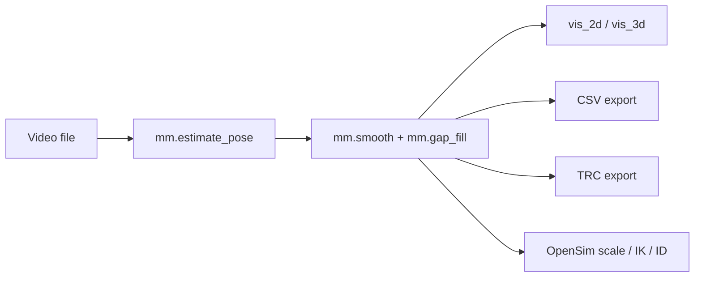

# Stage Overview

`monomech` keeps each major operation explicit. You can run only the stage you need, inspect its output, and continue later.

## Video-First Path

## Marker-First Path

## Main APIs

| Stage | API | Notes |
| --- | --- | --- |
| Estimate global pose | `mm.estimate_pose(path)` | Requires `monomech[pose]`. |
| Smooth data | `mm.smooth(result_or_trc)` | Works with pose, marker results, and TRC files. |
| Fill gaps | `mm.gap_fill(result_or_trc)` | Interpolates short gaps. |
| Preview pose | `pose.vis_2d()`, `pose.vis_3d()` | Notebook-friendly frame checks. |
| Scale model | `mm.run_scaling(...)` | Requires OpenSim-compatible bindings. |
| Inverse kinematics | `mm.run_ik(...)` | Returns an IK `StorageResult`. |
| Inverse dynamics | `mm.run_id(...)` | Accepts measured or estimated external loads. |
| Visualize | `mm.animate(...)` | Creates a notebook-ready HTML viewer. |

## Stage Outputs

| Stage | Main result | What to inspect |
| --- | --- | --- |
| 2D pose | `Pose2DResult` | Source-frame overlay, landmark confidence, missing frames. |
| Global 3D pose | `Pose3DGlobalResult` | Floor alignment, foot clearance, landmark trajectories. |
| TRC export | `.trc` | Marker names, units, axes, and time range. |
| IK | `StorageResult` and `.mot` | Joint coordinate curves and marker errors. |
| External loads | `.xml` and `.mot` | Force signs, application points, and time coverage. |
| ID | `StorageResult` and `.sto` | Joint forces and moments. |
| Viewer | `OpenSimVisualizerResult` | Motion, forces, IK, and ID in one synchronized page. |

For a visual walkthrough, open the [pipeline tour](../pipeline-tour.md).
