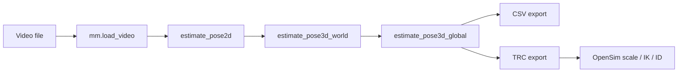
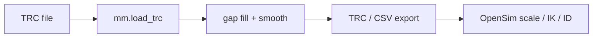

# Stage Overview

`monomech` keeps each major operation explicit. You can run only the stage you need, inspect its output, and continue later.

## Video-First Path

## Marker-First Path

## Main APIs

| Stage | API | Notes |
| --- | --- | --- |
| Load video | `mm.load_video(path)` | Creates a `VideoTrial`. |
| Estimate 2D pose | `trial.estimate_pose2d()` | Requires `monomech[pose]`. |
| Estimate world pose | `trial.estimate_pose3d_world()` | Uses pose results from the video stage. |
| Estimate global pose | `trial.estimate_pose3d_global()` | Produces global coordinates suitable for export. |
| Load markers | `mm.load_trc(path)` | Creates a `MarkerTrial`. |
| Clean markers | `trial.clean_markers()` | Gap fill and smooth marker trajectories. |
| OpenSim | `trial.run_opensim_*()` | Requires OpenSim-compatible bindings. |
