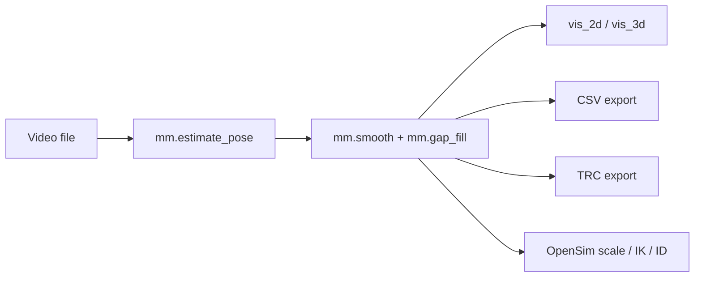

# Stage Overview

`monomech` keeps each major operation explicit. You can run only the stage you need, inspect its output, and continue later.

## Video-First Path

## Marker-First Path

## Main APIs

| Stage | API | Notes |
| --- | --- | --- |
| Estimate global pose | `mm.estimate_pose(path)` | Requires `monomech[pose]`. |
| Smooth data | `mm.smooth(result_or_trc)` | Works with pose, marker results, and TRC files. |
| Fill gaps | `mm.gap_fill(result_or_trc)` | Interpolates short gaps. |
| Preview pose | `pose.vis_2d()`, `pose.vis_3d()` | Notebook-friendly frame checks. |
| Load markers | `mm.load_trc(path)` | Creates a `MarkerTrial`. |
| Scale model | `mm.run_scaling(...)` | Requires OpenSim-compatible bindings. |
| Inverse kinematics | `mm.run_ik(...)` | Returns an IK `StorageResult`. |
| Inverse dynamics | `mm.run_id(...)` | Accepts measured or estimated external loads. |
| Visualize | `mm.animate(...)` | Creates a notebook-ready HTML viewer. |
