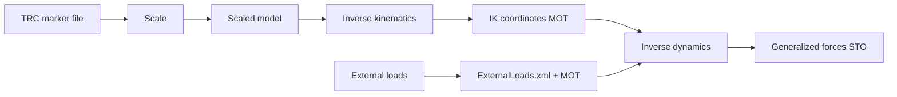

# OpenSim

OpenSim helpers are available on `VideoTrial` and `MarkerTrial`. They write setup files, run OpenSim tools, read outputs back into result objects, and keep useful paths in metadata.

## Requirements

Install OpenSim-compatible Python bindings before calling OpenSim methods.

```bash
python -m pip install "monomech[opensim]"
```

You can also use a conda OpenSim installation as long as Python can import an `opensim` module.

## The OpenSim Path



## Built-In Models

```python
import monomech as mm

print(mm.list_builtin_osim_models())
model_path = mm.get_builtin_osim_model("pose")
```

By default, bundled models are copied without mesh display geometry. This avoids missing `.vtp` visualization warnings during command-line runs. For GUI workflows:

```python
model_path = mm.get_builtin_osim_model("pose", include_geometry=True)
```

## 1. Scale

```python
scale = trial.run_opensim_scale(
    model_path=model_path,
    trc_path="outputs/subject01/subject01_global.trc",
    output_dir="outputs/subject01/scale",
)

print(scale.scaled_model_path)
print(scale.setup_xml_path)
print(scale.metadata["preflight"])
```

Use a stable subsection when the full trial contains extra movement:

```python
from monomech import OpenSimScaleConfig

scale = trial.run_opensim_scale(
    model_path=model_path,
    trc_path=trc_path,
    config=OpenSimScaleConfig(time_window=(0.25, 1.25)),
)
```

## 2. Inverse Kinematics

```python
ik = trial.run_opensim_ik(
    model_path=scale.scaled_model_path,
    trc_path=trc_path,
    output_dir="outputs/subject01/ik",
)

print(ik.path)
display(ik.to_dataframe().head())
print(ik.metadata["marker_error_summary"])
```

Add marker weights when some markers should matter more:

```python
from monomech import OpenSimIKConfig

ik = trial.run_opensim_ik(
    model_path=scale.scaled_model_path,
    trc_path=trc_path,
    config=OpenSimIKConfig(
        marker_weights={
            "right_ankle": 5.0,
            "left_ankle": 5.0,
        },
    ),
)
```

## 3. External Loads

Inverse dynamics can run with no external loads for a setup check, but meaningful kinetics usually need measured or estimated external forces.

```python
estimated_loads = mm.external.estimate_grf(
    pose3d=run.pose3d_global,
    body_mass_kg=75.0,
)
```

For measured force data:

```python
right_grf = mm.external.from_csv(
    "data/right_force_plate.csv",
    applied_to_body="calcn_r",
    force_columns=("Fx", "Fy", "Fz"),
    point_columns=("Px", "Py", "Pz"),
    torque_columns=("Mx", "My", "Mz"),
    time_column="time",
    name="right_grf",
)
```

See [External loads and forces](forces.md) for measured force plates, arrays, manual loads, carried loads, estimated GRF, and troubleshooting.

## 4. Inverse Dynamics

```python
id_result = trial.run_opensim_id(
    model_path=scale.scaled_model_path,
    ik_path=ik.path,
    external_forces=estimated_loads,
    output_dir="outputs/subject01/id",
)

print(id_result.path)
display(id_result.to_dataframe().head())
```

Generated external-load files are reported in metadata:

```python
print(id_result.metadata["external_loads_xml_path"])
print(id_result.metadata["external_loads_mot_path"])
print(id_result.metadata["coordinate_preflight"])
```

## Preflight And NaN Handling

OpenSim is sensitive to NaNs and infinite values. The helpers run automatic preflight fixes by default.

| Stage | Default check | Output |
| --- | --- | --- |
| Scale | TRC marker values must be finite. NaNs are interpolated. | `*_opensim_ready.trc` when needed |
| IK | TRC marker values must be finite. NaNs are interpolated. | `*_opensim_ready.trc` when needed |
| ID | IK coordinate values must be finite. NaNs are interpolated. | `*_coordinates_opensim_ready.mot` when needed |
| External loads | Forces and points are numeric and aligned to IK time. | `*_external_loads.mot`, `*_ExternalLoads.xml` |

Inspect preflight metadata:

```python
print(scale.metadata["preflight"])
print(ik.metadata["preflight"])
print(ik.metadata["marker_error_summary"])
print(id_result.metadata["coordinate_preflight"])
```

Disable automatic fixes when you want strict failures:

```python
from monomech import OpenSimIKConfig, OpenSimIDConfig

ik = trial.run_opensim_ik(
    model_path=scale.scaled_model_path,
    trc_path=trc_path,
    config=OpenSimIKConfig(sanitize_marker_data=False),
)

id_result = trial.run_opensim_id(
    model_path=scale.scaled_model_path,
    ik_path=ik.path,
    config=OpenSimIDConfig(sanitize_coordinates=False),
)
```

## Logs

OpenSim can print a line per frame during IK. `monomech` runs OpenSim tools in quiet mode by default and writes stage logs next to the outputs.

```python
print(scale.metadata["log_path"])
print(ik.metadata["log_path"])
print(id_result.metadata["log_path"])
```

Set `quiet=False` when you want OpenSim output in the console:

```python
from monomech import OpenSimIKConfig

ik = trial.run_opensim_ik(
    model_path=scale.scaled_model_path,
    trc_path=trc_path,
    config=OpenSimIKConfig(quiet=False),
)
```

## Practical Checklist

<div class="mono-path" markdown>
<div class="mono-step" markdown>
**Check marker names**

Compare TRC marker names against the OpenSim model before scale and IK.
</div>
<div class="mono-step" markdown>
**Inspect preflight reports**

Review filled channels, all-missing channels, and generated OpenSim-ready files.
</div>
<div class="mono-step" markdown>
**Review IK error**

Use the marker error summary before trusting the IK coordinates.
</div>
<div class="mono-step" markdown>
**Validate loads**

Confirm force directions, point units, timing, and `applied_to_body` before interpreting ID.
</div>
</div>
